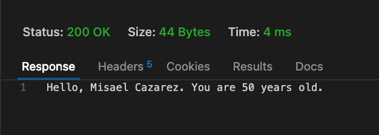

# Steps to Create the POC

Certainly! Let’s create a simple Proof of Concept (POC) using Azure Functions with C#. In this example, we’ll build an HTTP-triggered Azure Function that processes incoming JSON data and logs a message.


#### 1. **Set Up the Environment**

- **Install Prerequisites**:
  - [.NET SDK](https://dotnet.microsoft.com/download)
  - [Azure Functions Core Tools](https://docs.microsoft.com/en-us/azure/azure-functions/functions-run-local#v2)
  - Visual Studio Code or Visual Studio with the Azure Functions extension.

#### 2. **Create a New Function App**

**Using Command Line:**

```bash
func init MyFunctionApp --dotnet
cd MyFunctionApp
func new --name MyHttpFunction --template "HTTP trigger" --authlevel "anonymous"
```

This will create a new function app named `MyFunctionApp` and a new HTTP-triggered function named `MyHttpFunction`.

#### 3. **Implement the Function Logic**

Navigate to `MyFunctionApp/MyHttpFunction.cs` and update the code:

```csharp
using System.IO;
using Microsoft.AspNetCore.Mvc;
using Microsoft.Azure.WebJobs;
using Microsoft.Azure.WebJobs.Extensions.Http;
using Microsoft.AspNetCore.Http;
using Microsoft.Extensions.Logging;
using Newtonsoft.Json;

public static class MyHttpFunction
{
    [FunctionName("MyHttpFunction")]
    public static async Task<IActionResult> Run(
        [HttpTrigger(AuthorizationLevel.Function, "post", Route = null)] HttpRequest req,
        ILogger log)
    {
        log.LogInformation("Processing a new request...");

        string requestBody = await new StreamReader(req.Body).ReadToEndAsync();
        dynamic data = JsonConvert.DeserializeObject(requestBody);

        string name = data?.name;
        int age = data?.age ?? 0;

        log.LogInformation($"Received name: {name}, age: {age}");

        var responseMessage = $"Hello, {name}. You are {age} years old.";
        return new OkObjectResult(responseMessage);
    }
}
```

This function reads JSON data from the request body, logs the `name` and `age` properties, and returns a greeting message.

#### 4. **Run the Function Locally**

```bash
func start
```

This starts the function app locally. You will see a message indicating the function URL, typically something like `http://localhost:7071/api/MyHttpFunction`.

#### 5. **Test the Function**

Use a tool like `curl`, Postman, or `httpie` to send a POST request to the function endpoint.

Example using `curl`:

```bash
curl -X POST http://localhost:7071/api/MyHttpFunction \
-H "Content-Type: application/json" \
-d "{\"name\": \"John\", \"age\": 30}"
```

You should receive a response:

```json
"Hello, John. You are 30 years old."
```

Using Thunder Clien extension in VSCode


Response.



#### 6. **Deploy to Azure**

1. **Log in to Azure CLI**:

   ```bash
   az login
   ```

2. **Create a Resource Group**:

   ```bash
   az group create --name MyResourceGroup --location eastus
   ```

3. **Create a Function App**:

   ```bash
   az functionapp create --resource-group MyResourceGroup --os-type Windows --runtime dotnet --runtime-version 6 --functions-version 4 --name MyFunctionApp --storage-account MyStorageAccount
   ```

4. **Publish the Function**:

   ```bash
   func azure functionapp publish MyFunctionApp
   ```

### Summary

You’ve now created a basic Azure Function in C# that processes HTTP requests, logs data, and returns a response. You can expand on this by adding more functionality, such as additional triggers, integration with other Azure services, or more complex processing logic. 
